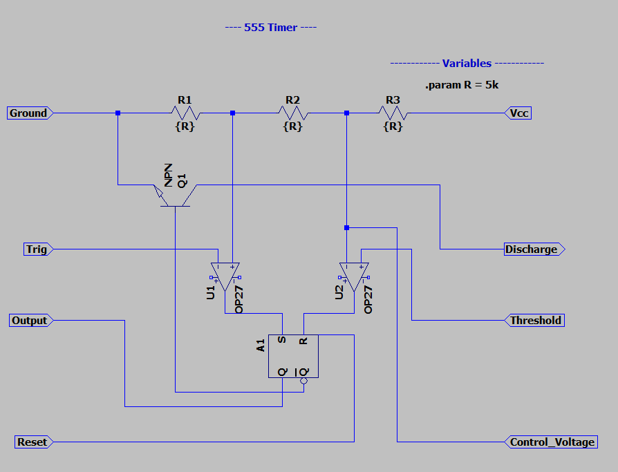
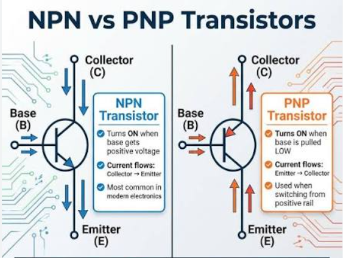

### 555 Timer Notes
A timing circuit that utilizes (3) 5k R's, a BJT, two comparators and 1 set, reset flip flop: 

#### Pins
1. Ground:
2. Trig:  - when this falls below 1/3 Vcc then the output goes high
3. Output: Output from chip: ~ 1.5V lower than VCC when high & ~ 0V when low
 - 555 timer can give only 100 - 200 mA total
4. Reset: inverted, normal state is high and resets when pin goes low
5. Control Voltage: controls threshold voltage of threshold pin
6. Threshold: when above (2/3 of Vcc) sets output back to low when voltage goes high  
7. Discharge: is disconnected when output is high, connected to ground when output is low. connects to external timing components.
8. Vcc: positive power supply, 5V < Vcc < 15V

#### Comparator
Long-tailed diff pairs using pnp jfets with common tail. Base terminals connected to 1/3Vcc and trig pin.

#### PNP Forward Biasing
base must be **lower** voltage than emitter: V_EB = V_E - V_B
- as base voltage increases, the difference decreases meaning **less forward biased**

- emitter pins are both connected to shared node, tail current source I_tail: V_E
- V_EB1 = V_E - V_ref
- V_EB2 = V_E - V_trig
  
BJT's exponentially sensitive to forward bias, current flows through path of least resistance/greatest V_EB.
