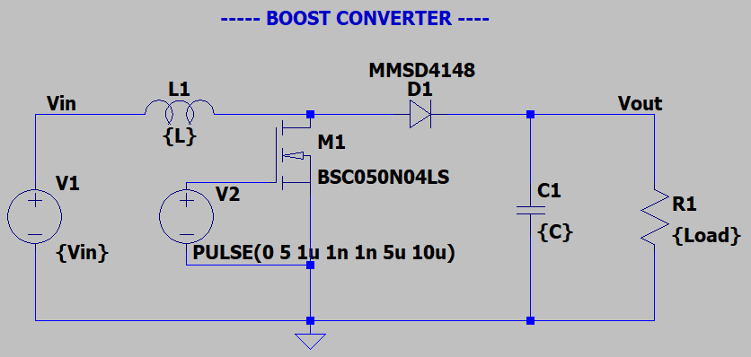
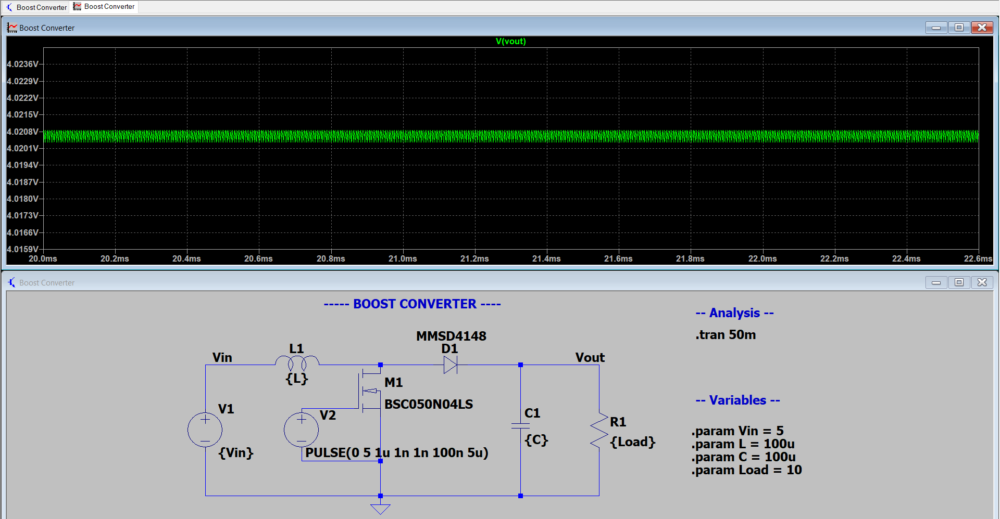
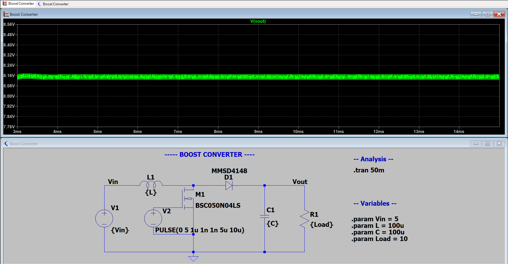
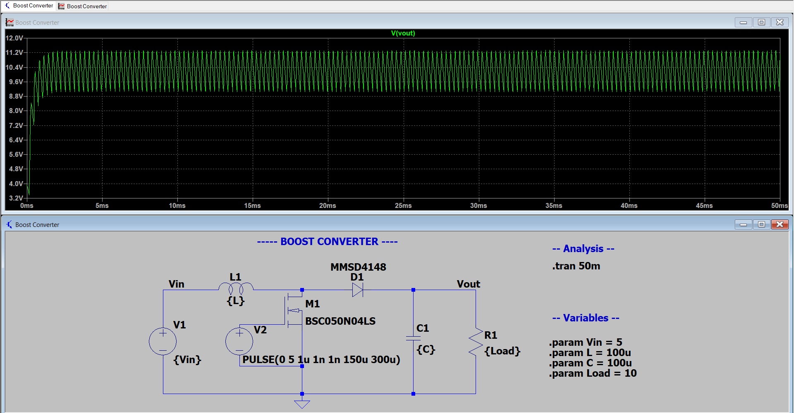
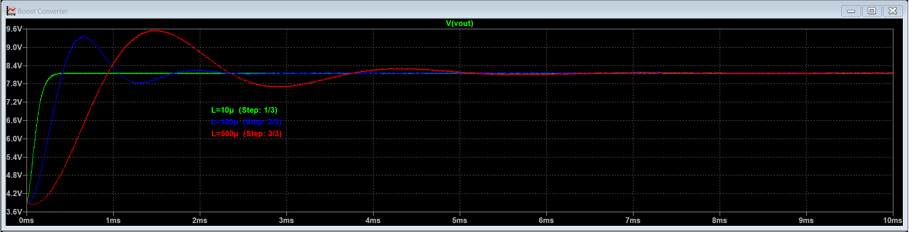

# Boost Converter
- DC-DC voltage booster, working principle: utilizes inductor's characteristic of storing energy in mfield, its resistance to current change which induces voltage spikes due to the charging/discharging of mfield, and its changing polarity.

## Topology

- R load can also be voltmeter

## Function
1) M1 off: Vin travels through D1 to Load
- I flows through load which has high R so I is low.
- L1 had zero stored energy, it resists change to small I shift so V spikes small amount.
- L1 then charges mfield with small I until fully charged, then it becomes shorted. while charging the polarity is positive on left and negative on right (subtracting from Vin).
- C1 charges from current (charge carriers) of battery when L1 no longer inhibits current from flowing.
2) M1 turns on: Vin travels through lowest impedance path M1 to ground
- Minimal resistance through M1 (5 mOhms) so current jumps high in loop.
- Current increase is resisted in L1 by quick voltage spike across it, while mfield stores energy. while mfield grows, polarity is positive left and negative right (subtracting from Vin).
- Once charged, it is short circuit and current travels to ground through mos.
- C1 discharges to load to ensure steady Vout.
3) M1 turns off: Vin travels through D1 to Load
- Current drops again due to larger resistive path, L1 resists current change by discharging mfield.
- While mfield is discharging, polarity is negative on left, positive on right (in series with battery).
- Vout is then larger than Vin due to mfield stored energy adding with Vin, and C1 charges up to new, greater Vout.
4) M1 turns on: Vin travels through mos to ground.
- current increases again; current change is resisted creating a voltage spike, charging mfield occurs, and polarity is negative (subtracting from Vin)
- Cap with stored energy of mfield + Vin discharges to output.

Repeat^

**Mosfet on period must be short so that the stored energy of cap doesn't completely dissipate, resulting in step charging sequence each repetition. Eventually steady state will be reached**

Voltage swing with small t_on for mos: 
V swing with large t_on for mos: 
- smaller voltage swing for smaller t_on, but also less Vout. why? because cap doesn't have enough time to charge up from stored energy? trying a larger t_on param. 
  - even larger t_on resulted in larger Vout and larger Vswing
  - so as t_on increases, cap dissipates more energy, resulting in more Vswing but why does the overall Vout still have a greater average value?
    - is it because with greater t_on the more the mfield can charge up resulting in greater delta between Vin and Vout?
  
**Increasing R_load: increases voltage swing, increases steady-state time, increases final Vout**

**Increasing L: increases settling time, increases peak voltage in initial swing (makes sense because V = L(dI/dt)), does not affect voltage swing**

**Increasing C: decreases voltage swing (makes sense because I = C(dV/dt) so as C increases dV/dt decreases), increases settling time**