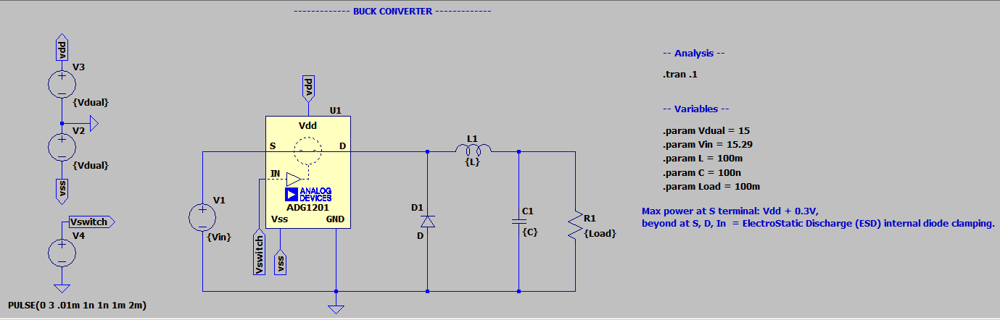
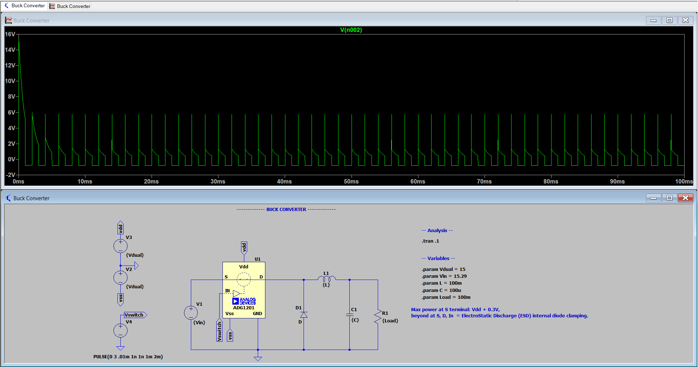
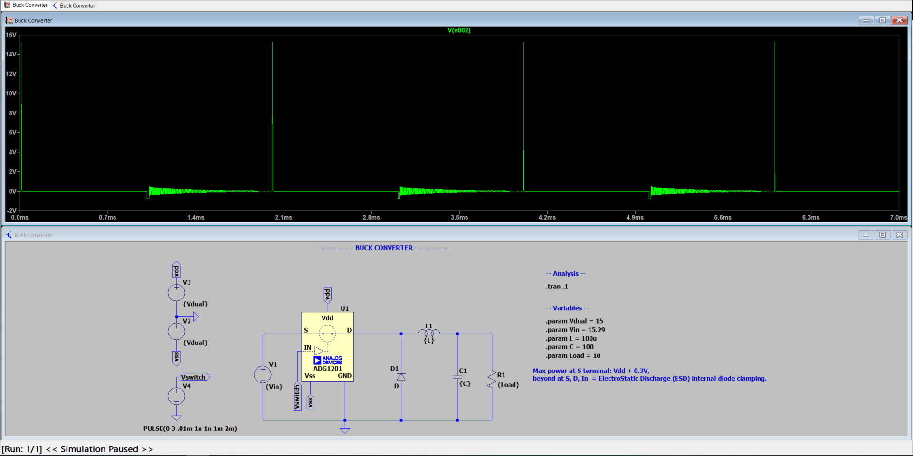
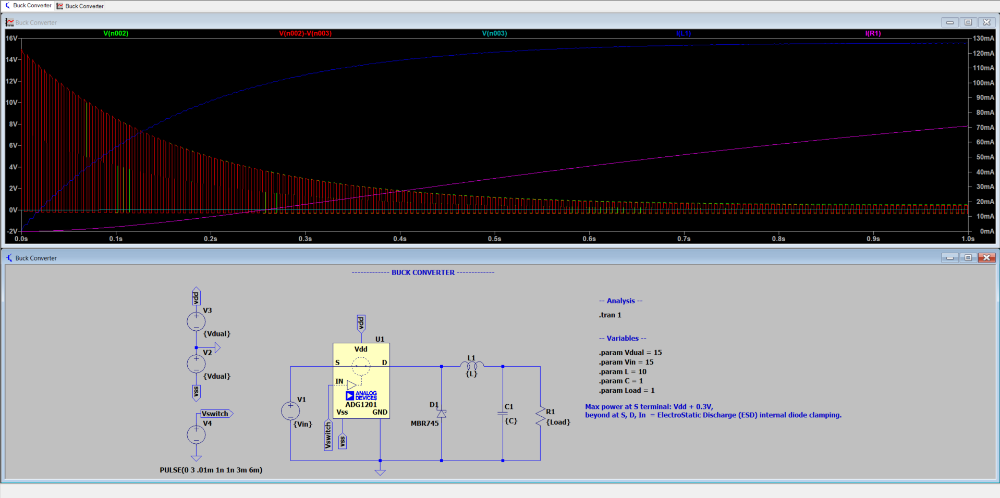
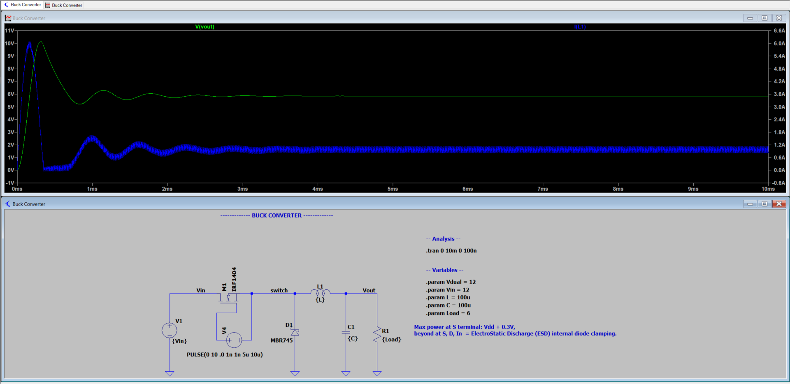
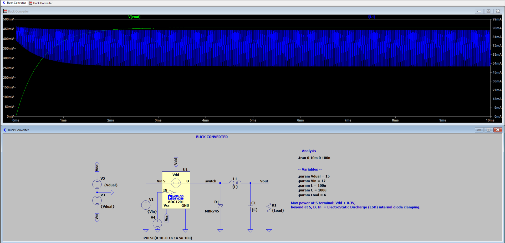
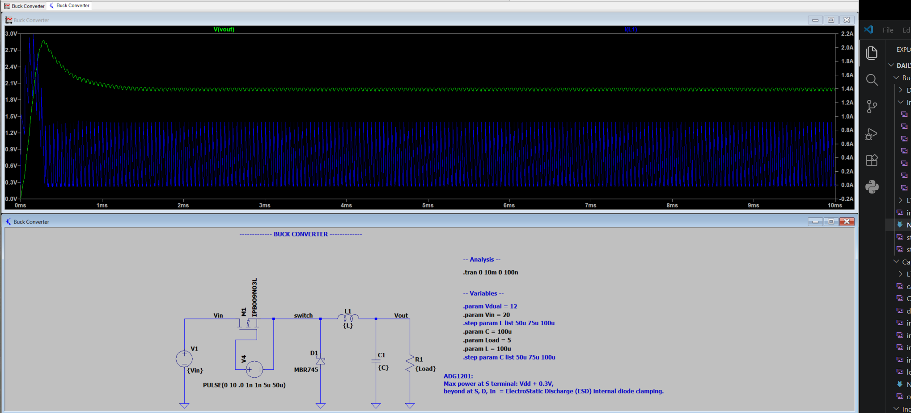
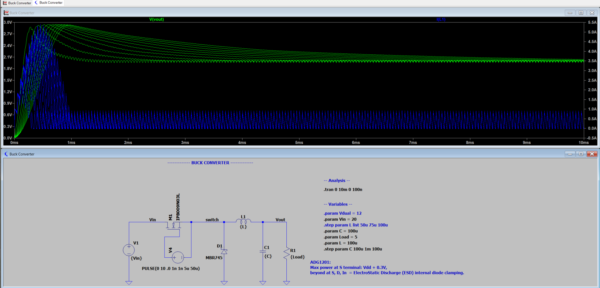
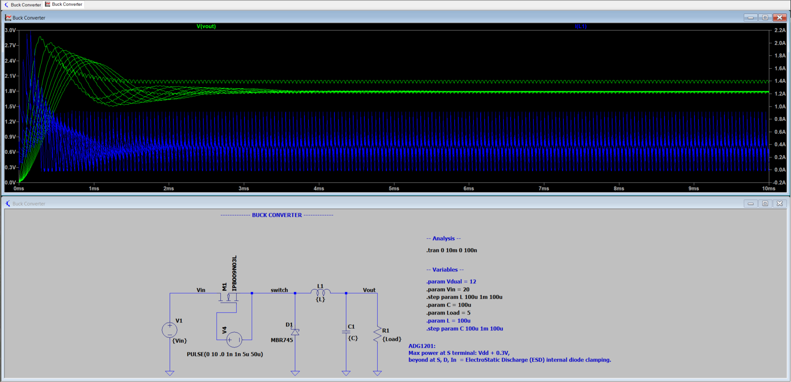
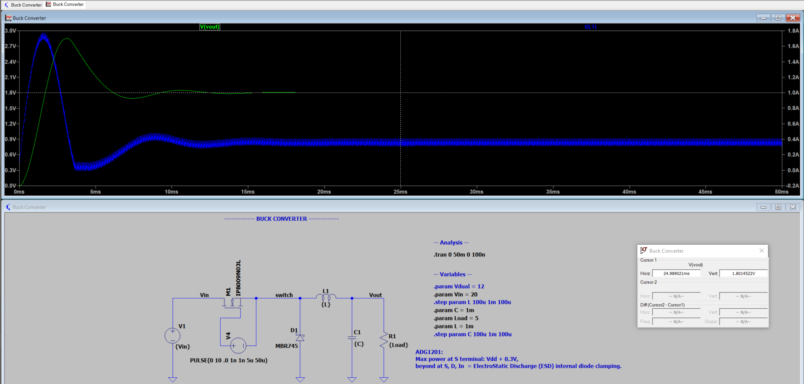

# Buck Converter
- DC-DC voltage step-down. in analog can use much simple transformer (two inductors), but in DC, need to abuse the energy storing attributes of cap and ind.

- ADG1201 has max input power rating of VDD + 0.3V at terminal S, for 15V Vsupply, Vin <= 15.3V
  
Current switching results in voltage spikes:
Vdual = 15V
Vin = 15.29V
L = 100m
C = 100u
R = 100m

## Achieving steady DC
- I thought decreasing C & R would decrease the charge/discharge time for circuit, making it smoother. but output is equivalent as before with C = 100n, R = 100n.
- Increasing to C = 100, R = 10 also doesn't change the output trend.
- Changing L strongly affects output because **V = L(dI/dt)**
- in image below L decreased to increase dI/dt. Behavior I believe is dI/dt too large, dispanding mfield energy, while the capacitor then discharges slower at the 1ms mark
- 

- also experience Vspikes, i think because there isn't enough charge in the inductor to charge it up before the circuit switches off and needs to dispell.
- 

**forgotten to actually select the diode, as soon as diode selected (MBR745), output no longer spiked**

first working solution: mosfet and diode selection from example circuit: 

**Vout = D(Vin), D = duty cycle**
duty cycle = roughly 50%, Vin = 12V, Vout = 5.85V

- kept everything same except replacing nmos with SPST ADG1201 with 15V dual supply, then the output becomes corrupt: 

### MOS v ADG1201 SPST
- ADG1201 has 120Ohm R_on. this creates a huge voltage divider compared to a small R_load (in this case 6Ohms). much less current in the circuit as a result of this large R_on. MOS works because it has 3.5 mOhms R_on; much smaller voltage divider drop across switch.
- increasing R (Load: 6, 25 50): increases oscillation settling time, increases Vout, decreased current oscillation settling time, decreased current.
- also decreasing R below 1Ohm results in a no oscillation just logarithmic curve to steady state dc or if R < 500m, then V stayes ~ 0V.
- increasing L: decreases initial amplitude, increases settling time for both Vout and I
    - if L is too small, then not enough mfield energy can be stored and released when off, so the Voltage just stores in capacitor and as a result stays relatively constant higher than desired Vin(D)
- increasing C: increases initial amplitude for V and I, increases oscillation settling time for both V and I (I = C(dV/dt)).
    - if C too small (tested C: 1n 1u 100u), then I and V never reach steady state, only oscillations; not enough to charge and release energy given the change in Vin.
**both L and C affect timing and oscillation, but not Vout.**

- choosing a mosfet with a smaller on resistance results in a higher Vout for same circuit component values, and also slightly higher current.

- if the duty cycle becomes too low, then the off state will be long enough that the C/L will both completely discharge before switches back on, resulting in voltage dips: 
  - in this case, increasing C/L enough will smooth out curve:
C - 
I - 
both - 