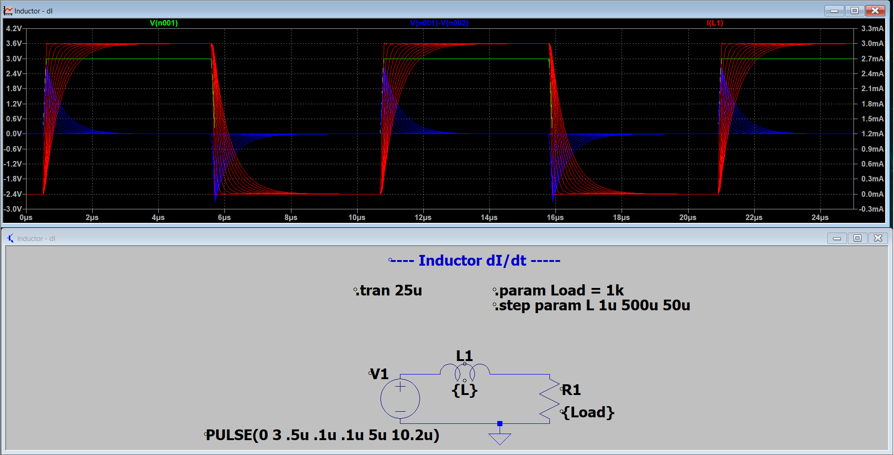

# Inductors
- Energy storing device
- Resists change in current due to Lenz's Law - a back/opposing EMF force is briefly created to resist immediate current change
    - the opposing EMF induces voltage spikes at the instananeous time Vsource changes
    - the Voltage across Inductor is always proportional to dI/dt as seen below.
    - **V proportional to dI/dt**

This circuit has an ideal inductor with zero series resistance.

V = L(dI/dt), **higher L, smaller dI/dt, and vice versa**

L = [u(N^2)A]/l
L = N(phi)/I

Reactance (X_L) = opposition to AC
X_L = 2(pi)fL = (omega)L

Impedance = total opposition to current flow, resistance & reactance (real and imaginary)

Inductor in series with resistance: Z = sqrt(R^2 + (X_L)^2)